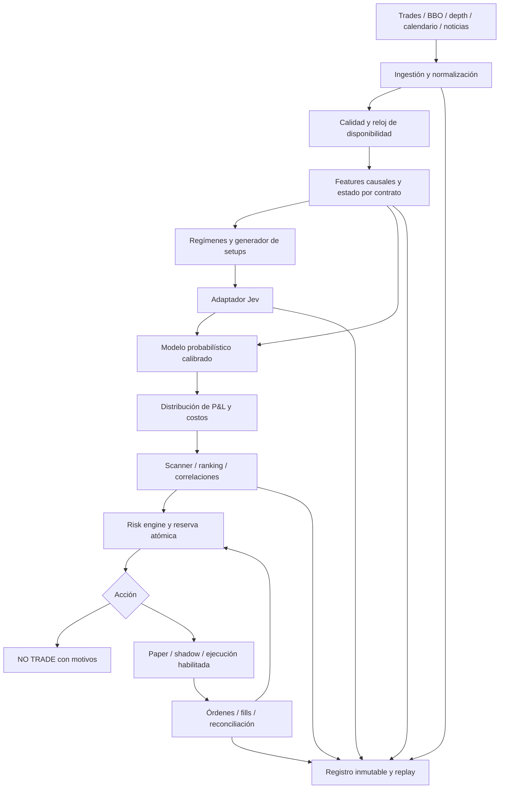

# Plan técnico: scanner probabilístico multiinstrumento con Jev

**Versión:** 1.0 — 3 de octubre de 2026  
**Estado:** diseño para revisión; no se ha implementado ni contratado ningún servicio.  
**Objetivo:** detectar, comparar y seleccionar oportunidades intradía en futuros mediante probabilidades calibradas, valor esperado neto y restricciones de riesgo.  
**Resultado permitido:** seleccionar una oportunidad o emitir **NO TRADE**. Una oportunidad no implica una orden.

## Índice

1. Objetivos, alcance y decisiones iniciales
2. Principios probabilísticos y económicos
3. Arquitectura y recorrido de una decisión
4. Datos, proveedores y contratos de futuros
5. Esquema de datos y contratos entre módulos
6. Feature engineering y regímenes
7. Setups iniciales
8. Integración Jev / System One
9. Etiquetado, entrenamiento y calibración
10. Scanner, ranking y correlaciones
11. Backtesting y validación temporal
12. Risk engine y prop firms
13. Ejecución eventual
14. Stack y estructura del repositorio
15. Testing, métricas y observabilidad
16. Roadmap y criterios de aceptación
17. Recursos, costos y decisiones pendientes
18. Riesgos técnicos y checklist
19. Fuentes

## 1. Objetivos, alcance y decisiones iniciales

### 1.1 Qué se construirá

Un sistema que recibe eventos de varios mercados, construye un estado causal por instrumento, detecta candidatos con reglas explícitas, obtiene clasificaciones estructuradas de Jev, estima el resultado económico de cada candidato y compara las alternativas disponibles en ese momento.

La unidad de selección será **instrumento + contrato + dirección + setup + política de entrada/salida + momento**, no el instrumento aislado. ES long con stop de 8 ticks y horizonte de 10 minutos no es el mismo problema probabilístico que ES long con stop de 30 ticks y horizonte de 60 minutos.

El sistema debe responder:

- ¿Hay un setup reconocible y ejecutable con los datos disponibles?
- ¿Qué probabilidad tiene cada resultado bajo una política definida?
- ¿Cuál es el beneficio esperado después de costos y fills realistas?
- ¿Cómo cambia el riesgo de la cuenta si se toma esta oportunidad?
- ¿Conviene tomarla, esperar o rechazarla?

No se fija como objetivo una tasa de acierto arbitraria. La prueba de utilidad será desempeño fuera de muestra, después de costos, comparado con baselines y acompañado por incertidumbre estadística. Ningún resultado del plan constituye evidencia de rentabilidad.

### 1.2 Universo y crecimiento

| Etapa | Universo propuesto | Motivo / condición |
|---|---|---|
| Investigación inicial | ES, NQ, GC | Comparación entre índices y otro factor; controlar alcance |
| Scanner ampliado | ES, NQ, YM, RTY, CL, GC, 6E | Ampliar únicamente con datos suficientes por mercado |
| Piloto eventual | Micros disponibles y autorizados | Dimensionamiento más fino; validar su propio spread y fills |

Estos instrumentos son una propuesta de investigación, no una afirmación de que hoy exista edge en ellos. El mínimo MVP multiinstrumento debe conservar al menos dos mercados simultáneos; un experimento monoinstrumento sirve como prueba de componentes.

### 1.3 Alcance del MVP

- Intradía; posiciones cerradas antes de la hora límite configurada.
- Contexto de 1, 5 y 15 minutos y ventanas por eventos/ticks.
- Motor general para tres setups; habilitación gradual: Liquidity Reversal, Trend Continuation, Breakout.
- Datos de trades y BBO como base, profundidad cuando el setup la necesite.
- Calendario macro como filtro inicial; noticias textuales en una fase posterior.
- Replay, scanner, ranking y paper trading; ejecución real deshabilitada.
- Una posición nueva a la vez en el MVP; cartera posterior sujeta a límites conjuntos.

### 1.4 Decisiones de diseño

| ID | Decisión | Razón | Revisión |
|---|---|---|---|
| ADR-001 | Jev clasifica contexto; no envía órdenes | Separar percepción de probabilidad financiera y riesgo | Evaluación de aporte incremental |
| ADR-002 | Núcleo dirigido por eventos y reloj inyectable | Reutilizar lógica en replay y vivo | Paridad de features |
| ADR-003 | MVP como monolito modular | Reducir complejidad operativa | Separar procesos cuando el perfil lo exija |
| ADR-004 | NO TRADE como acción normal | Evitar elegir la mejor de opciones deficientes | Curvas de cobertura/EV |
| ADR-005 | Datos crudos inmutables y versiones completas | Reproducibilidad y auditoría | Política de licencias/retención |
| ADR-006 | Especificaciones y reglas por vigencia | Contratos, horarios y cuentas cambian | Revisión antes de cada despliegue |

## 2. Principios probabilísticos y económicos

### 2.1 Definir “trade ganador”

Separar dos cantidades:

1. `p_target_first`: probabilidad de tocar la barrera objetivo antes del stop, condicionada a fill y dentro del horizonte.
2. `p_net_positive`: probabilidad de P&L realizado positivo después de costos bajo la política completa.

Pueden diferir por timeouts, salidas anticipadas, fills parciales, gaps y costos. Mostrar ambas cuando el modelo las soporte; no renombrar automáticamente la primera como “probabilidad de ganar”.

Resultados básicos mutuamente excluyentes después de fill: `TARGET`, `STOP`, `TIME_EXIT`. Conservar además `NO_FILL` y `INVALID_DATA`; este último no es una pérdida ni un timeout. Un cierre de sesión puede formar parte de TIME_EXIT con motivo específico. El resultado es de la política congelada, no una propiedad universal del setup.

### 2.2 Expected Value neto

Para resultados k condicionados a entrada ejecutada:

```text
EV_filled_USD = Σ_k P(k | X, fill, policy) × E[net_PnL_USD | k, X, fill, policy]
EV_attempt_USD = P(fill | X, order_policy) × EV_filled_USD
                 - E[costos no incluidos asociados al intento]
```

La factorización requiere un modelo condicionado al mecanismo de fill: los fills de órdenes limitadas pueden sufrir selección adversa. No usar una probabilidad de fill independiente con un modelo de resultado entrenado sobre otra política.

Caso binario simplificado, con gain/loss antes de costos y costos medios C:

```text
EV = p × G - (1-p) × L - C
p_break_even = (L + C) / (G + L)
EV_R = EV_USD / riesgo_planificado_USD
```

Este caso excluye timeouts y salidas variables. Si net_PnL ya incorpora spread, slippage y comisión, no volver a restarlos. El spread puede estar implícito en precios bid/ask simulados; se registrará la convención de costos.

Ejemplo puramente ilustrativo por contrato:

| Candidato | p binaria | Ganancia G | Pérdida L | C | EV |
|---|---:|---:|---:|---:|---:|
| A | 0.72 | $80 | $120 | $8 | $16 |
| B | 0.55 | $200 | $100 | $10 | $55 |

Mayor acierto no implica mayor EV. Tampoco mayor EV en dólares implica mejor uso del riesgo si las posiciones tienen escalas distintas.

### 2.3 Risk-Adjusted EV (RAEV)

Definir una utilidad interna explícita, no presentarla como una métrica financiera universal:

```text
RAEV_USD(a | portfolio) = EV_net_USD(a)
                         - λ × incremental_ES_loss_USD(a)
                         - γ × uncertainty_penalty_USD(a)
```

`ES_loss` es Expected Shortfall de pérdidas a un nivel predefinido, por ejemplo 95%, estimado sobre escenarios conjuntos de posiciones y candidato. λ y γ son coeficientes adimensionales elegidos solamente en validación. `uncertainty_penalty` puede ser `max(0, EV_estimado - límite_inferior_EV)` obtenido con bootstrap temporal y ensembles. No confundir Expected Shortfall con el ticker ES.

Reportar EV en USD, EV en R, límite inferior de EV, cola de pérdidas y RAEV por separado. Para comparar contratos, calcular primero por unidad de riesgo comparable y después valorar cada tamaño permitido. Evitar multiplicar otra vez `p × EV × quality`: EV ya incorpora probabilidades y ese producto carece de interpretación clara.

### 2.4 NO TRADE

La utilidad incremental de permanecer sin una posición nueva se fija en 0 para el ranking. Solo seleccionar una acción si:

- Es válida para datos, sesión, ejecución y reglas de cuenta.
- Supera el umbral neto configurado y su incertidumbre resulta aceptable.
- Su RAEV supera 0 y el margen mínimo operativo fijado en validación.
- Mantiene capacidad de riesgo después de reservas y escenarios adversos.

La abstención no elimina la obligación de administrar posiciones existentes. NO TRADE significa “no abrir exposición nueva”.

## 3. Arquitectura y recorrido de una decisión



### 3.1 Módulos

| Módulo | Responsabilidad | Entrada | Salida |
|---|---|---|---|
| Instrument registry | Identidad, tick, multiplicador, vigencias, roll | Metadata oficial/proveedor | ContractSpec versionado |
| Market adapters | Recuperar y normalizar eventos | Feed histórico/live | MarketEvent |
| Quality gate | Secuencias, staleness, gaps, estado de libro | Eventos/heartbeats | QualityState |
| Session engine | Calendarios y cierres | Tiempo UTC, calendar version | SessionState |
| Book builder | Libro y recuperación | MBO/MBP, snapshots | BookState |
| Feature engine | Ventanas causales y estado | Eventos disponibles | FeatureSnapshot |
| Regime engine | Tendencia/rango/volatilidad | Features | RegimeEstimate |
| Setup engine | Máquina de estados por setup | Features/regímenes | Candidate |
| Jev adapter | Clasificación con contrato interno estable | State + question spec | ClassificationResult |
| Outcome model | Probabilidades y distribución de resultado | Snapshot + Jev + policy | Prediction |
| Cost/fill model | Probabilidad de fill y fricción | Orden, libro, latencia | ExecutionEstimate |
| Scanner/selector | Comparación sincronizada | Predicciones vigentes | Decision |
| Risk engine | Veto, tamaño, exposición, reservas | Decision + AccountState | RiskDecision |
| Order manager | Ciclo de vida/reconciliación | Intent autorizado | Orders/Fills |
| Labeler/trainer | Dataset y modelos reproducibles | Replay y candidatos | Labels/model artifacts |
| Audit/monitoring | Trazabilidad y alarmas | Todos los módulos | Eventos, dashboards |

### 3.2 Secuencia de una oportunidad

1. Registrar evento con timestamp de bolsa, recepción y disponibilidad local.
2. Validar secuencia y recuperar libro si hay discontinuidad.
3. Actualizar features usando únicamente información disponible para ese instante.
4. Actualizar régimen y estado del setup; no crear entradas repetidas por cada tick.
5. Si aparece un candidato, congelar snapshot y política, asignar ID y vencimiento.
6. Aplicar filtros baratos: sesión, spread, noticias, capacidad de datos, cuenta.
7. Consultar Jev asíncronamente con deadline; mientras tanto el mercado continúa.
8. Al recibir respuesta, verificar versión, esquema, TTL y vigencia del candidato.
9. Inferir resultados y costos; reconstruir contexto actual si el retraso cambió la ejecutabilidad.
10. En un epoch de decisión común, ordenar candidatos válidos y comparar con NO TRADE.
11. Revalidar cotización y riesgo; reservar capacidad de forma atómica.
12. Publicar señal paper o, en una fase autorizada, OrderIntent.
13. Registrar fill, resultado y todos los motivos de rechazo; liberar reservas al terminar.

### 3.3 Presupuestos temporales propuestos

Diseño para horizontes de minutos, no HFT. Metas iniciales de ingeniería sujetas a benchmark:

- Features locales: p95 menor de 50 ms por lote a carga nominal.
- Candidato a decisión con Jev: p95 menor de 1 segundo en sesión normal.
- Deadline Jev: 1.5 segundos; no reintentar si el candidato ya venció.
- TTL inicial: 2 segundos para señales sensibles al libro; configurable por setup.
- Revalidación de precio/riesgo inmediatamente antes de enviar una orden.

La latencia publicada por un proveedor no es un SLA ni reemplaza medición desde el despliegue elegido. El replay deberá incorporar latencia realista, no recibir las clasificaciones instantáneamente.

## 4. Datos, proveedores y contratos de futuros

### 4.1 Niveles de capacidad

| Nivel | Datos mínimos | Habilita | No permite afirmar |
|---|---|---|---|
| A | OHLCV y calendarios | Prototipo de estructura/régimen | Delta real, footprint o fills intrabar exactos |
| B | Trades + BBO con secuencia/tiempos | Spread, flujo agresor cuando es identificable, replay marketable | Cola exacta o profundidad completa |
| C | Trades + profundidad MBP | Desequilibrio por niveles, simulación conservadora | Orden individual/cola exacta |
| D | MBO y metadata suficiente | Libro por órdenes, aproximación de cola más rica | Fill real garantizado o liquidez oculta completa |

MBO contiene eventos por orden y nivel; Databento documenta campos como ID de orden, acción, secuencia y timestamps de evento/recepción. Las particularidades dependen de venue/dataset. [Fuente: esquema MBO](https://databento.com/docs/schemas-and-data-formats/mbo).

Ningún setup que necesite un dato ausente se habilitará con una feature inventada. Si falta lado agresor, marcar `unknown`, especificar algoritmo inferido y medir su error; no duplicar trades y fills del feed al sumar volumen.

### 4.2 Evaluación y contratación

Evaluar Databento como candidato de datos históricos/live y feeds del broker o plataforma para ejecución. No se confirma aquí compatibilidad con una cuenta concreta. Para cada proveedor obtener:

- Cobertura exacta de contratos y fechas; muestra de una sesión ordinaria y una de alta volatilidad.
- Trades, BBO, MBP/MBO, eventos de reset, snapshots, correcciones y metadata.
- Semántica de timestamps, agresor, secuencia y orden de mensajes.
- Licencia para almacenamiento, uso algorítmico, derivados y envío de estados a Jev.
- Costos de descarga, suscripción, bolsa, usuarios, egress y retención.
- Límites, recuperación, replay histórico y diferencias entre feed histórico y live.
- Ubicación, disponibilidad, soporte y posibilidad de fijar versiones.

**Gate de compra:** muestra procesada, cobertura suficiente, permisos compatibles y cotización documentada. No adquirir MBO para todo el universo antes de medir volumen y utilidad.

### 4.3 Contratos, roll y sesión

- Operar y simular contratos concretos; conservar root y expiry separadamente.
- Registrar tick size, tick value, multiplicador, moneda y horarios desde metadata verificada.
- Fijar política de roll causal: por calendario o volumen observado hasta el momento; no usar volumen total futuro para decidir el contrato del día.
- Excluir ventanas de expiración/entrega según ContractSpec; no asumir que todos liquidan en efectivo.
- Series continuas ajustadas solo para análisis de largo plazo identificado; fills y niveles ejecutables en precios del contrato real.
- Libro, CVD y referencias de sesión reinician según política documentada al cambiar contrato.
- Al ejecutar micros con señales del mini, tratarlo como otra política: datos, costos, ticks y riesgo propios; validar basis y liquidez.
- UTC para almacenamiento; calendarios con zona IANA de la bolsa. La interfaz del usuario puede mostrar America/Hermosillo. No codificar un offset fijo para Chicago/Nueva York.

CME describe las diferencias de multiplicadores y ticks entre Micro E-mini y sus contratos mayores; las especificaciones vigentes deben confirmarse por producto antes de operar. [Fuente: CME Micro E-mini](https://www.cmegroup.com/education/courses/micro-e-mini-futures/micro-e-mini-futures-products-overview).

### 4.4 Noticias y calendario

MVP: eventos programados con tipo, mercado afectado, hora publicada y ventana de bloqueo pre/post configurable. Fuente oficial para fechas: BLS y organismos emisores; BLS publica calendario de Employment Situation. [Fuente: BLS](https://www.bls.gov/schedule/news_release/empsit.htm).

Producción: feed licenciado con `published_at`, `first_seen_at`, `received_at`, ID estable, correcciones y versiones. Conservar titular/texto permitido y vínculo al original. La disponibilidad para features es la recepción efectiva, nunca la hora retrospectiva del artículo.

El “surprise” macro requiere dato inicial publicado y consenso disponible antes de publicación. No usar datos revisados ni consenso actualizado posteriormente. Sin archivo histórico point-in-time, usar únicamente calendario y bloqueo; excluir features retrospectivas de sentimiento del backtest principal.

Texto de noticias es dato no confiable: no puede modificar instrucciones, límites ni políticas. Jev solo puede clasificarlo dentro de preguntas cerradas y no puede invocar ejecución.

### 4.5 Calidad, retención y dimensionamiento

Raw append-only con checksums y manifiesto por partición; curated con normalización versionada. Particionar por proveedor/dataset/fecha/contrato, evitando millones de archivos minúsculos.

Registrar gaps, duplicados, timestamps fuera de orden, cotizaciones cruzadas, volumen anómalo y reinicios. Después de gap de depth: no reutilizar libro anterior como válido; recuperar snapshot y recalentar ventanas. Un instrumento inválido se excluye; si el problema afecta una feature transversal, invalidar candidatos dependientes.

Medir una muestra antes de presupuestar:

```text
storage ≈ events_per_day × bytes_per_event_compressed × days × contracts
          + índices + features + snapshots + backups
API_calls ≈ candidates_passed_prefilter × calls_per_candidate
```

Duplicar provisión temporal durante procesamiento y backups según política. La retención depende de licencia: datos para auditoría pueden requerir hashes y referencias si no se permite conservar contenido completo.

## 5. Esquema de datos y contratos entre módulos

### 5.1 Convenciones comunes

- Precios como enteros escalados o decimal exacto; nunca comparar ticks con floats sin redondeo explícito.
- Timestamps UTC de precisión suficiente; distinguir event time de availability time.
- Cada mensaje: `schema_version`, `event_id`, `trace_id`, `source`, `source_sequence`, `contract_id` cuando aplique.
- Cada artefacto derivado: `as_of`, `max_input_available_at`, `created_at`, `feature_version`, `policy_version` y hashes de entradas.
- Missing es `null` con motivo; cero es un valor válido. Unidades obligatorias.
- Invariantes: precios alineados a tick, cantidades enteras no negativas, probabilidades en [0,1], suma de clases aproximadamente 1.
- Evolución compatible por campos opcionales; cambios de semántica generan nueva versión mayor y migración explícita.

### 5.2 Entidades persistentes

| Entidad | Campos clave | Clave / relación |
|---|---|---|
| instruments | root, venue, currency, contract_id, expiry, tick, multiplier, valid_from/to | contract_id + vigencia |
| market_events | ts_event, ts_recv, available_at, action, price, size, side, order_id, flags | source + channel + sequence + rtype |
| sessions | session_id, open, close, holiday, calendar_version | venue + date |
| news_versions | news_id, version, published_at, first_seen_at, received_at, text_hash | news_id + version |
| feature_snapshots | snapshot_id, as_of, values, units, missingness, lineage | snapshot_id |
| regimes | snapshot_id, probabilities, volatility_state, liquidity_state | snapshot_id + engine_version |
| candidates | candidate_id, contract, setup, direction, policy, barriers, expiry | candidate_id |
| jev_evaluations | state_hash, questions_hash, requested/resolved_model, response, latency | evaluation_id |
| predictions | candidate_id, probability vector, EV, uncertainty, calibrator_id | prediction_id |
| decisions | epoch_id, candidates, ranking, winner/null, reason_codes | decision_id |
| risk_reservations | account_id, intent_id, reserved_risk, expiry, state | reservation_id |
| order_events/fills | client_order_id, broker_id, state, quantity, price, timestamps | append-only event_id |
| outcomes | candidate_id, fill_policy, label, net_PnL, MAE, MFE, label_start/end | candidate + label_version |
| model_registry | model_id, training_cutoff, dataset_hash, metrics, status | model_id |
| account_snapshots | balance, equity, HWM, floor, reserved_risk, rule_version | account_id + timestamp |

### 5.3 Contratos internos propuestos

Estas firmas son diseño interno, no SDKs ya implementados:

```python
MarketAdapter.stream(contracts, start_at) -> AsyncIterator[MarketEvent]
BookBuilder.apply(event) -> BookUpdate
FeatureEngine.update(event, clock) -> list[FeatureSnapshot]
RegimeEngine.estimate(snapshot) -> RegimeEstimate
SetupEngine.advance(snapshot, regime) -> list[Candidate]
Classifier.classify(state, question_spec, deadline) -> ClassificationResult
OutcomeModel.predict(candidate, snapshot, classification) -> Prediction
ExecutionModel.estimate(candidate, book, latency_profile) -> ExecutionEstimate
Selector.select(epoch, predictions, portfolio) -> Decision
RiskEngine.authorize_and_reserve(decision, account) -> RiskDecision
ExecutionGateway.submit(intent) -> SubmissionResult
ExecutionGateway.reconcile(account_id) -> ReconciliationReport
ReplayEngine.run(manifest, strategy_version, execution_profile) -> RunReport
Labeler.label(candidate, future_path, execution_policy) -> Outcome
```

Solo Labeler/simulador de resultados reciben `future_path`; nunca el feature engine o el selector. Inyectar un `Clock` con `now()` y timers para replay y vivo, sin llamadas dispersas al reloj del sistema.

### 5.4 Ejemplo de candidato interno

```json
{
  "schema_version": "1.0",
  "candidate_id": "example-session-contract-0001",
  "contract_id": "CONTRACT_FROM_REGISTRY",
  "root": "ES",
  "setup": "LIQUIDITY_REVERSAL",
  "direction": "LONG",
  "snapshot_id": "snapshot-0001",
  "policy_version": "lr-market-bracket-v1",
  "decision_as_of": "2026-10-02T14:00:00Z",
  "expires_at": "2026-10-02T14:00:02Z",
  "entry": {"type": "MARKETABLE_LIMIT", "reference_price_ticks": 20000, "max_slippage_ticks": 2},
  "stop_price_ticks": 19988,
  "target_price_ticks": 20024,
  "max_holding_seconds": 900,
  "quality": {"book_valid": true, "news_blocked": false},
  "state": "READY"
}
```

Valores sintéticos, sin señal de mercado. El precio de entrada es referencia; tras fill se registra el real y se aplica la política congelada de barreras. No modificar el target retrospectivamente para mejorar etiqueta.

### 5.5 Decision y motivos

`Decision` incluye ganador nullable, acción `PROPOSE_TRADE/NO_TRADE`, lista completa de candidatos, ranks, EV/RAEV, edad de features y versiones. `RiskDecision` puede rechazar el ganador; el selector puede intentar el siguiente solo mediante una política registrada y sin saltar vetos globales.

Códigos estables: `NO_SETUP`, `STALE_DATA`, `BOOK_GAP`, `MISSING_FEATURE`, `NEWS_WINDOW`, `JEV_TIMEOUT`, `MODEL_UNSUPPORTED`, `LOW_SAMPLE_SUPPORT`, `OOD`, `EV_TOO_LOW`, `UNCERTAIN_EV`, `CORRELATION_LIMIT`, `DAILY_LIMIT`, `DRAWDOWN_BUFFER`, `MARKET_CLOSED`, `PRICE_MOVED`, `ACCOUNT_UNRECONCILED`.

## 6. Feature engineering y regímenes

### 6.1 Catálogo inicial

| Familia | Features | Ventana / normalización | Precaución causal |
|---|---|---|---|
| Precio | retornos, rango, cuerpos/mechas, pendiente, distancia a extremos | 1m/5m/15m, ticks y ATR pasado | Barra parcial identificada; cierre solo tras disponibilidad |
| Tiempo | minuto de sesión, tiempo desde apertura/evento | Calendario de bolsa | DST y jornadas especiales |
| Volumen | relativo, intensidad, volumen por precio | Comparar con sesiones anteriores a misma hora | No dividir por volumen final del día |
| VWAP | distancia, pendiente, bandas | Acumulado de sesión hasta t | Reset de sesión documentado |
| Profile | POC/VAH/VAL previos y desarrollándose | Sesión anterior y acumulado actual | Perfil final del día prohibido intradía |
| Flujo | delta, CVD, tasa de compras/ventas | 10s/60s/5m, escala robusta | Agresor conocido vs inferido |
| Footprint | diagonal imbalance, stacked runs | Tick/barra, mínimo volumen | Lado sin volumen no implica ratio infinito útil |
| Depth | imbalance por niveles, microprice, replenishment | Estado actual + cambios pasados | Libro válido y niveles accesibles |
| Liquidez | spread, profundidad, cancel/trade ratio | Medianas trailing por sesión | Liquidez visible no equivale a intención |
| Estructura | swing confirmado, sweep, retest, displacement | Máquina causal | Swing solo disponible tras confirmación |
| Volatilidad | ATR, realized vol, jump score | Ventanas trailing | Umbrales ajustados solo en train |
| Macro | tiempo al evento, categoría, surprise disponible | As-of real de publicación | Vintage inicial/consenso histórico |
| Transversal | retornos relativos, beta, correlación, dispersión | Ventanas comunes disponibles | No forward-fill prolongado |

Para cada feature definir en `feature_catalog`: fórmula, unidad, inputs, disponibilidad, ventana, warm-up, reset, clipping, missingness, versión y fixture de verificación. Selección de features, imputación y escalado se ajustan dentro de cada fold de entrenamiento.

### 6.2 Definiciones cuantitativas iniciales

```text
delta = Σ signed_trade_size; desconocidos en bucket separado
CVD(t) = acumulación causal de delta desde reset definido
imbalance_depth = (Σ bid_size - Σ ask_size) / (Σ bid_size + Σ ask_size)
distance_vwap_atr = (last_price - VWAP_asof) / ATR_trailing
relative_volume = observed_volume_so_far / median(historical_volume_same_window)
displacement = signed_move / local_volatility, con volumen y duración explícitos
```

Absorción es una **proxy observable**: volumen agresivo elevado contra un nivel, desplazamiento limitado y evidencia de replenishment si hay depth. No afirmar que identifica órdenes ocultas o intención de un participante.

### 6.3 Régimen como varias dimensiones

Evitar una sola lista que mezcle tendencia y volatilidad. Usar:

- Estructura: `TREND_UP/TREND_DOWN/RANGE/TRANSITION/UNKNOWN`.
- Volatilidad: `LOW/NORMAL/HIGH/SHOCK`.
- Liquidez: `NORMAL/THIN/IMPAIRED`.
- Estado de evento: `NORMAL/PRE_NEWS/POST_NEWS/UNKNOWN`.

Baseline determinista: pendiente/ATR, eficiencia direccional, alternancia de extremos y cuantiles trailing. Jev aporta una distribución contextual separada. Posteriormente evaluar HMM o clustering, con ajuste solo en train y filtrado online; no usar smoothing que incorpora observaciones futuras.

Hysteresis y mínimo tiempo de permanencia evitan alternar régimen en cada tick. Estados inciertos permiten abstención. Cada setup especifica qué dimensiones acepta y cuáles lo bloquean.

## 7. Setups iniciales

Todos usan estados `IDLE → ARMED → TRIGGERED → READY → EXPIRED/INVALIDATED/CONSUMED`. Los umbrales siguientes son parámetros de investigación: se congelarán tras validación. Long/short deben tener tests simétricos, sin asumir desempeño simétrico.

### 7.1 Liquidity Reversal

**Hipótesis:** barrida de un extremo conocido, retorno dentro del rango y respuesta del flujo pueden anticipar reversión de corto plazo.

1. Definir nivel conocido: high/low de sesión anterior, opening range ya cerrado o swing confirmado previamente.
2. ARMED si precio se aproxima al nivel dentro de distancia normalizada.
3. Detectar cruce mínimo en ticks, duración máxima y volumen requerido.
4. Confirmar reclaim del nivel; absorción proxy o divergencia de delta calculada con ventanas cerradas/disponibles.
5. Exigir displacement contrario y, si la política lo requiere, retest dentro de timeout.
6. Crear entrada marketable o limit, stop más allá del extremo observado + buffer y target congelado por nivel/R.
7. Invalidar si vuelve a romper extremo, cambia régimen, vence el retest o se activa bloqueo macro.

**Features clave:** profundidad del sweep, tiempo fuera, reclaim speed, delta divergente, volumen agresor, distancia VWAP, distancia a siguiente nivel, régimen HTF.

**No confundir:** todo nuevo mínimo con un sweep. Un rompimiento sostenido no es automáticamente reversión. Las confluencias se probarán por ablación; no se multiplicarán probabilidades independientes de señales correlacionadas.

### 7.2 Trend Continuation

**Hipótesis:** tendencia causal, pullback controlado y reanudación del flujo favorecen continuación.

1. Régimen direccional persistente en contexto 5m/15m disponible.
2. Impulso previo con eficiencia y volumen suficientes.
3. Pullback hacia referencia conocida: VWAP, estructura o banda predefinida.
4. Retroceso no invalida estructura y reduce presión contraria respecto al impulso.
5. Trigger por reanudación de agresión/ruptura microestructural y desplazamiento a favor.
6. Stop bajo/encima del swing causal del pullback; target por siguiente nivel o múltiplo R; horizon fijo.
7. Invalidar por estructura rota, régimen de rango, target demasiado cerca o exceso de extensión.

**Features clave:** profundidad/duración del pullback, pendiente normalizada, distancia al valor, delta relativo, presión contraria, volatilidad y espacio al target.

### 7.3 Breakout

**Hipótesis:** salida de una compresión o rango previamente definido con aceptación y participación puede continuar.

1. Rango calculado únicamente con ventana ya cerrada; guardar high/low al armar.
2. Compresión medida por rango/ATR y volatilidad trailing; no reconocer patrón usando expansión futura.
3. Cruce del límite con buffer en ticks y volumen mínimo.
4. Confirmación de aceptación por tiempo/precios fuera o retest; comparar variantes como políticas distintas.
5. Stop por interior de rango o swing de retest; target fijo antes de entrada.
6. Invalidar por retorno sostenido dentro, spread excesivo, flujo incompatible o noticia bloqueada.

**Features clave:** duración y anchura del rango, intentos previos, volumen relativo, agresión, liquidez visible, distancia a resistencia/soporte próximo.

### 7.4 Duplicados y conflictos

ID de evento base + contrato + setup + dirección + versión de política. Cooldown por nivel y sesión. Si dos setups describen el mismo movimiento, conservar ambos para estudio pero agruparlos como una sola exposición; la selección no los cuenta como evidencias independientes.

Si hay candidatos long y short simultáneos del mismo contrato: resolver por política registrada o abstenerse por ambigüedad. Prohibir abrir ambos para “cubrir” incertidumbre en el MVP.

## 8. Integración Jev / System One

### 8.1 Capacidades verificadas y límites

TypeSafe documenta preguntas Choice, Score y Noul sobre un estado común; Choice y Score incluyen distribuciones y confianza, mientras Noul entrega un valor de probabilidad sí/no. Las preguntas se evalúan separadamente dentro de una llamada. [Fuente: introducción](https://docs.typesafe.ai/introduction).

La confianza de Choice/Score se deriva de su distribución; no es una segunda estimación independiente. Noul no trae un campo de confianza separado. En este proyecto, ninguna de esas cantidades se interpretará directamente como tasa de éxito de trading. [Fuente: confianza](https://docs.typesafe.ai/confidence).

El anuncio presenta Jev en early access y comunica resultados del proveedor. No establece desempeño en futuros ni garantiza rentabilidad; una salida que respeta tipos puede clasificar incorrectamente el estado. [Fuente: anuncio](https://typesafe.ai/blog/introducing-system-one-models-and-jev).

### 8.2 Rol dentro del sistema

Jev recibe un resumen compacto con features calculadas, unidades, niveles disponibles, secuencia reciente y noticias admitidas. No calculará ATR, riesgo monetario o tamaño: esos cálculos pertenecen a código determinista.

Preguntas atómicas propuestas:

| ID | Primitiva | Qué evalúa |
|---|---|---|
| structure_context | Choice | Tendencia/rango/transición/insuficiente según evidencia dada |
| absorption_side | Choice | Buyers/sellers/none/insufficient_evidence |
| sweep_evidence | Noul | Evidencia de sweep según definición exacta |
| delta_support | Noul | Compatibilidad del delta con dirección del candidato |
| pullback_quality | Score | Rubrica ordenada de pullback defectuoso a limpio |
| breakout_acceptance | Score | Evidencia de aceptación, no probabilidad de éxito |
| news_relevance | Choice | Mercado afectado / irrelevante / incierto |
| state_sufficiency | Choice | Suficiente / parcial / insuficiente |

Rubricas incluirán criterios observables y opción insuficiente cuando corresponda. No enviar “BUY/SELL” como pregunta final. Las probabilidades de estas preguntas pueden ser features del modelo financiero, no una fórmula manual que garantice edge.

### 8.3 Transporte y contrato

La referencia oficial publica `POST https://api.typesafe.ai/v1/systemone`, autenticación Bearer y cuerpo con `state`, `model`, `questions`. Retorna `answers`, modelo y uso. La documentación incluye Choice con `criteria` por opción, Score con niveles ordenados y Noul con pregunta sí/no. [Fuente: API](https://docs.typesafe.ai/api).

El siguiente es un ejemplo de diseño del payload, sin llamada real:

```json
{
  "model": "jev-latest",
  "state": {
    "as_of": "2026-10-02T14:00:00Z",
    "candidate_direction": "LONG",
    "delta_last_60s_contracts": 240,
    "price_change_last_60s_ticks": -2,
    "book_valid": true,
    "missing_fields": []
  },
  "questions": {
    "delta_support": {
      "type": "noul",
      "instructions": "¿El delta observado apoya la dirección indicada? Usa solo el estado; no predigas rentabilidad."
    }
  }
}
```

`jev-latest` sirve para discovery, pero un experimento reproducible necesita modelo resuelto/fijado cuando el proveedor lo permita. El adaptador guarda versión efectiva, payload, hash de rubricas y respuesta. Los campos internos de auditoría no se agregan arbitrariamente al contrato HTTP.

### 8.4 Disponibilidad y fallos

- Verificar acceso, versiones, cuotas y permisos antes de estimar cronograma definitivo.
- Timeout/circuit breaker, presupuesto de llamadas y colas acotadas por deadline.
- Cache por hash exacto de estado + preguntas + modelo; no por similitud aproximada.
- Cancelar solicitudes de candidatos vencidos; descartar respuestas tardías.
- Validar correspondencia de preguntas, enums, probabilidades y valores finitos.
- Si falla Jev: NO TRADE o baseline independiente expresamente validado y versionado; nunca completar confianza con 1 ni reutilizar una respuesta vieja.
- Separar fallback en resultados y métricas para no atribuir desempeño a Jev.

### 8.5 Evaluación incremental y contaminación histórica

Comparar en los mismos folds: reglas solas, features cuantitativas, cuantitativas + Jev, y cuantitativas + noticias + Jev. Reportar Brier/log loss, calibración, EV, cobertura, costo y latencia, con intervalos por sesión.

Jev puede incorporar conocimiento de sucesos históricos desde su entrenamiento. Que el estado suministrado sea causal no prueba que el modelo externo sea históricamente point-in-time. Registrar este riesgo; evaluar una variante sin nombres/fechas de eventos identificables, no afirmar que la anonimización lo elimina, y exigir prueba prospectiva shadow. La evidencia retrospectiva con un modelo actual es exploratoria si no se puede garantizar su disponibilidad/conocimiento histórico.

No asumir fine-tuning, self-hosting, SLA, residencia o versiones perpetuas: confirmar con TypeSafe. Las preguntas y políticas se congelan antes de OOS; no ajustar rubricas al observar test. Consultar límites conocidos del modelo elegido antes de cada promoción. [Fuente: límites Jev 1.13](https://docs.typesafe.ai/model-jaggedness/jev-1.13).

## 9. Etiquetado, entrenamiento y calibración

### 9.1 Dataset por candidato

Guardar todos los candidatos, incluidos rechazados, con su estado y resultado contrafactual bajo una política simulada. No entrenar solo con operaciones elegidas por el scanner: eso introduce sesgo de selección.

Los outcomes contrafactuales dependen del simulador y no equivalen a fills realmente observados. Separar `simulated_outcome`, `paper_outcome` y `live_outcome`; nunca mezclar su calidad de evidencia sin flags.

Campos mínimos: candidato, snapshot, as-of, sesión, contrato, setup, dirección, barreras, política, estado Jev y modelo, fill/no-fill, label_start/end, resultado neto, MAE/MFE, motivo terminal, calidad, costos y perfil de latencia.

### 9.2 Etiquetado por barreras

1. En t0 se conoce el candidato y se congela la política.
2. La orden llega tras latencia de procesamiento/red configurada.
3. Simular si se llena, a qué precio y con qué cantidad.
4. Después de fill, recorrer ticks ejecutables hasta target, stop o barrera temporal.
5. Aplicar salida de sesión, parciales y manejo de gaps según política.
6. Calcular P&L neto y etiquetas; guardar intervalo completo de información futura usado.

Si target y stop parecen tocados en una misma vela sin orden intrabar conocido, la etiqueta es ambigua: replay de ticks o hipótesis conservadora explícita. No atribuir target primero por conveniencia.

`p_target_first` excluye no-fill y condiciona a fill; time-exit se conserva como clase. `p_net_positive` se deriva de resultado neto, no de un `TARGET` sin costos.

### 9.3 Modelos candidatos

- Baseline 0: tasa histórica por setup/sesión con shrinkage y soporte mínimo.
- Baseline 1: regresión logística/multinomial regularizada.
- Challenger: gradient boosting tabular para interacciones no lineales.
- Modelos complementarios de fill, P&L conditional y cuantiles/colas cuando haya soporte.
- Pooling entre instrumentos con identidad y features normalizadas; calibración por grupos solo con muestras suficientes.

No crear cientos de modelos por instrumento/régimen/setup con muy pocos ejemplos. Preferir modelos compartidos y evaluaciones segmentadas, y habilitar segmentos únicamente cuando sean defendibles.

### 9.4 Separación de bloques

Orden temporal propuesto por fold:

```text
TRAIN → purga/gap → CALIBRATION → purga/gap → POLICY_VALIDATION → purga/gap → TEST
```

Train aprende transformaciones/modelo; calibration ajusta probabilidades; policy validation fija umbrales, λ/γ y tamaños; test se usa una sola vez para evaluar el conjunto congelado. Si se usan predicciones out-of-fold, todas deben provenir de modelos entrenados sin información futura del ejemplo.

La calibración requiere datos independientes del ajuste del modelo. Sigmoid y isotonic son opciones; elegir según soporte y evaluación temporal, sin usar particiones aleatorias por defecto. Brier/log loss no miden exclusivamente calibración; acompañarlos de reliability plots. [Fuente: scikit-learn](https://scikit-learn.org/stable/modules/calibration.html).

### 9.5 Calibración y soporte

- Calibrar probabilidades de resultados mutuamente excluyentes; verificar suma y efectos de normalización multiclass.
- Comparar calibración global vs segmentada sin usar test para elegir.
- Bins de igual frecuencia con recuento y bandas de incertidumbre; no informar “80%” con tres observaciones como certeza.
- Bootstrap por días/sesiones o bloques mayores, no por ticks independientes.
- Umbral de soporte inicial propuesto: al menos 100 outcomes para reportar un segmento; esto no basta por sí solo para producción.
- Objetivo de investigación: 1,000+ candidatos válidos por setup cuando la frecuencia lo permita, múltiples regímenes y meses; priorizar tamaño efectivo y precisión de intervalos sobre conteos brutos.
- Muestras superpuestas ponderadas por unicidad o agrupadas; registrar sensibilidad al método.

### 9.6 Entrenamiento y promoción

Pipeline reproducible: manifest → replay causal → candidatos → Jev cache/evaluaciones → outcomes → splits purgados → transformaciones → modelos → calibrador → política → reporte → registry.

Cada bundle incluye cutoff, hashes, semillas, dependencias, contrato de features, rubricas Jev, costos, calibrador y política. Un cambio de Jev, features, barreras o costos requiere reevaluación; no sustituir solo el modelo y conservar métricas viejas.

Reentrenamiento inicial offline mensual como hipótesis operativa; frecuencia definitiva según drift y etiquetas maduras. No aprendizaje online automático en el MVP. Promoción champion/challenger con evaluación, shadow y rollback al bundle anterior.

## 10. Scanner, ranking y correlaciones

### 10.1 Comparación sincronizada

Epochs de decisión, por ejemplo cada segundo y ante eventos relevantes. Usar estados cuyo `available_at <= epoch`; registrar edad por instrumento. Una clasificación pendiente no bloquea indefinidamente los demás, pero su ausencia queda explícita y no se presenta como comparación completa.

Para cada contrato: cero o más candidatos → filtros → probabilidades → EV por política/tamaño → RAEV incremental → ordenamiento. Los instrumentos sin candidato muestran NO SETUP; los candidatos malos muestran motivo de rechazo.

### 10.2 Selección

```text
valid = freshness ∧ feature_support ∧ session ∧ news ∧ model_support
eligible = valid ∧ EV_net > threshold ∧ risk_constraints
winner = argmax_a RAEV(a | current_portfolio), incluyendo NO_TRADE con utilidad 0
```

MVP: top-1 y una posición. Posteriormente resolver cartera restringida, no ejecutar simplemente top-k. Estimar costos del tamaño solicitado; escalar linealmente solo mientras sea una aproximación validada.

Si hay empate dentro de incertidumbre: preferir menor fricción/riesgo incremental o abstenerse mediante regla congelada. El ranking debe evaluarse sobre conjuntos simultáneos OOS, no juntando el mejor trade de distintas horas.

### 10.3 Correlaciones y exposición

- Retornos sincronizados trailing, ventanas cortas y largas, matriz regularizada.
- Grupos estructurales de índices, energía, metales y FX; los grupos no sustituyen estimación.
- Beta/factores y signo de posiciones: correlación de retornos no es correlación de P&L sin considerar dirección, tamaño, stop y horizonte.
- Límites de riesgo por grupo y escenarios de shock conjunto; ES/NQ/YM/RTY no equivalen a apuestas independientes.
- Penalizar riesgo marginal condicionado a cartera; impedir concentración aunque cada candidato tenga EV positivo.
- Si matriz está inestable o sin soporte, aplicar límites conservadores de grupo y no asumir correlación cero.
- Medir basis, exposición y correlación durante crisis; no tratar coberturas como eliminación de riesgo.

### 10.4 Interfaz del scanner

Tabla por candidato: hora, instrumento/contrato, setup, dirección, estado, p_target, p_net_positive, EV_USD/R, intervalo, riesgo, RAEV, edad y razones. Texto explicativo generado a partir de códigos y features registradas, no razonamiento inventado por Jev.

Diferenciar probabilidad de outcome, confianza de clasificación y calidad de datos visualmente. Mostrar “sin soporte” en vez de un porcentaje si corresponde. No convertir NO TRADE en un error rojo permanente; es un resultado operativo válido.

## 11. Backtesting y validación temporal

### 11.1 Replay realista

- Flujo multicontrato en orden de disponibilidad, con desempates deterministas y secuencias por canal.
- Mismo código de features, setups, selector y riesgo que en vivo.
- Warm-up previo a la sesión; no evaluar datos incompletos como features válidas.
- Latencia de feed, Jev, decisión y órdenes modelada por perfiles medidos/distribuciones.
- Disponibilidad retrasada de outputs Jev; snapshot y respuesta no son instantáneos.
- Simulador del libro según granularidad disponible; mensajes de reset/cancel/modify procesados.
- Market orders consumen liquidez ejecutable; stops disparan y se llenan después del trigger, con posibles gaps.
- Limits: tocar el precio no garantiza fill. Con MBP/BBO usar modelo conservador; con MBO aproximar prioridad y registrar incertidumbre, liquidez oculta y efectos de la propia orden.
- El flujo histórico exógeno no incluye impacto de nuestra operación: limitar tamaño y hacer stress de impacto.
- OCO, parciales, cancelación tardía, rechazos y órdenes en vuelo modelados antes de aprobar ejecución.

### 11.2 Protocolo anti-leakage

| Riesgo | Control obligatorio |
|---|---|
| Indicadores calculados sobre todo el dataset | Transformaciones ajustadas dentro de train |
| Swings futuros / zigzag retrospectivo | Registrar timestamp de confirmación |
| Barra HTF no cerrada | Identificar parcial y no usar cierre final |
| VWAP/profile de sesión completa | Acumulación as-of |
| Noticias revisadas / vintage final | Join por recepción y versión inicial |
| Roll por volumen futuro | Política causal congelada |
| Labels superpuestos | Purga por intervalos de etiqueta reales |
| Mismo evento en ES/NQ repartido entre folds | Split temporal global por sesión, todos los instrumentos juntos |
| Rubricas/features diseñadas viendo test | Registro de experimentos y test sellado |
| Clasificador externo actual sobre historia | Evidencia retrospectiva exploratoria + shadow prospectivo |
| Resultado usado en selección | Separación de interfaces Labeler/FeatureEngine |
| Cotización posterior usada como entrada disponible | Orden entra solo tras latencia y evento elegible |

Prueba causal fuerte: ejecutar hasta t, agregar/modificar todos los datos posteriores a t y exigir que candidatos/features/decisiones anteriores permanezcan idénticos. Probar también revisiones tardías: no reescribir lo que estaba disponible antes de recibirse.

### 11.3 Walk-forward

Ejemplo sujeto a datos: 6–12 meses train, 1–2 calibration, 1 policy validation, 1–2 test; avanzar por bloques y ampliar historia si soporte es insuficiente. Gap/purga determinada por el intervalo máximo de labels y cualquier lookback que produzca contaminación relevante; no elegir un gap arbitrario de “una vela”.

Eliminar del train toda etiqueta cuyo intervalo se solape con el bloque siguiente. En validación cruzada interna usar splitter purgado temporal con embargo cuando entrenar después de un bloque de evaluación pueda contaminarlo; en forward-only no introducir futuros dentro del train.

Reservar un holdout final reciente intacto; si se usa para corregir el modelo deja de ser holdout y se requiere otro. La promoción requiere evaluación sobre el conjunto de folds, no el mejor fold.

### 11.4 Robustez y búsqueda múltiple

- Registrar cada experimento y variante; declarar presupuesto de búsqueda antes de probar.
- Comparar con baseline sin Jev, baseline de setup, selección por EV y selección por p solamente.
- Stress: costos ×1.5/×2, slippage añadido, latencia p95/p99, fills conservadores, outages y noticias.
- Sensibilidad alrededor de parámetros, no un óptimo estrecho aislado.
- Ablaciones de features/setup/noticias/Jev y resultados por mercado/régimen/sesión.
- Bootstrap por bloques de P&L diario; preservar dependencia transversal en remuestreo.
- Reportar intervalos, múltiples comparaciones y, si procede, deflated Sharpe / probabilidad de sobreajuste como diagnósticos adicionales.
- Test de leave-one-instrument-out para capacidad de transferencia, sin sustituir OOS temporal.
- Incluir días sin trades, periodos malos y instrumentos deshabilitados; no ocultarlos del denominador.

### 11.5 Límites de inferencia

Un backtest demuestra el comportamiento bajo supuestos del simulador. Shadow observa decisiones prospectivas; paper prueba operaciones simuladas de la plataforma; live reducido prueba fricción real. Ninguna etapa reemplaza automáticamente a las demás.

## 12. Risk engine y prop firms

### 12.1 Autoridad y estado

Risk engine determinista con veto final independiente de Jev. Estado por cuenta: balance, equity, P&L realizado/no realizado, comisiones, high-water mark, piso de drawdown, reservas, órdenes en vuelo, exposición por grupo, hora de cierre y reglas vigentes.

Estados operativos: `DISABLED`, `SHADOW`, `PAPER`, `LIVE_ENABLED`, `HALTED`, `RECONCILING`. Arranque en RECONCILING; bloquear órdenes nuevas hasta confirmar posiciones y órdenes del broker.

### 12.2 Dimensionamiento

```text
risk_per_contract = abs(entry_price - stop_price) × point_value
                    + stop_slippage_reserve + costs_reserve
budget = min(per_trade_cap, remaining_daily_buffer,
             remaining_drawdown_buffer, group_capacity, portfolio_capacity)
contracts = floor(budget / risk_per_contract)
```

Si contracts < 1 → NO TRADE. Tick value, multiplicador y conversión monetaria provienen del registry vigente. El stop no garantiza pérdida máxima: guardar escenarios de gap mayores al riesgo planificado.

Propuesta conservadora para investigación: riesgo por trade limitado a una fracción pequeña del **buffer efectivo de pérdida**, por ejemplo 2–5%, y no al saldo nominal anunciado por una prop firm. El valor final depende de cuenta, distribución de pérdidas y reglas; debe congelarse antes del piloto. No usar martingale ni aumentar riesgo para recuperar pérdidas.

### 12.3 Controles obligatorios

- Pérdida diaria incluyendo unrealized, fees y riesgo de órdenes abiertas.
- Drawdown estático, trailing intradía o trailing EOD según contrato real.
- HWM actualizado en la frecuencia y base de cálculo correspondientes.
- Límite contratos por cuenta y equivalencias mini/micro verificadas.
- Riesgo agregado por grupo, máximo posiciones, rate limit de órdenes y cooldown.
- Bloqueo pre/post noticias y cierre forzoso con margen para fallos.
- Reserva atómica ante oportunidades simultáneas; evitar doble gasto del buffer.
- Kill switch manual y automático por feed inválido, órdenes desprotegidas, desajuste de cuenta, latencia o pérdidas.
- Reconciliación periódica y después de reconexión; estado del broker como referencia operativa.

Kill switch distinguirá `BLOCK_NEW`, `CANCEL_ENTRIES` y `FLATTEN`. No cancelar stops protectores al bloquear entradas. Flatten utiliza ruta autorizada y se confirma con fills/posición; si falla, mantener HALTED y alerta crítica, sin anunciar cuenta plana.

### 12.4 Perfil de reglas por firma/cuenta

Config versionada con: tipo evaluación/funded/live, vigencia, fuente, productos permitidos, horarios, drawdown, news policy, consistencia, payouts si afectan buffer, automatización/API, límites técnicos y requisitos de autorización. No existe una configuración universal “prop firm”.

Las reglas de Topstep consultadas ilustran que hay condiciones por modalidad y actualizaciones, además de prohibiciones de ciertas prácticas tecnológicas. No se asume autorización automática para este sistema ni se extrapolan reglas a otras firmas. Antes del piloto revisar el acuerdo específico, plataforma y permiso aplicable. [Fuentes: reglas Live](https://www.topstep.com/live-funded-account-rules), [estrategias prohibidas](https://help.topstep.com/en/articles/10305426-prohibited-trading-strategies-at-topstep).

Si una regla o permiso no está confirmado, ejecución real permanece deshabilitada; el trabajo de investigación y paper puede continuar dentro de términos del servicio correspondiente.

## 13. Ejecución eventual

### 13.1 Adaptador de broker/plataforma

Seleccionar después de conocer cuenta y API autorizada. Evaluar sandbox, órdenes bracket/OCO, stops alojados en servidor, marketable limits, IDs idempotentes, cancel/replace, estados, rate limits, reconexión y consulta de fills históricos. No elegir el broker solo por acceso a datos.

### 13.2 Máquina de estados de orden

```text
CREATED → RISK_RESERVED → SUBMITTING → ACKNOWLEDGED
        → PARTIALLY_FILLED → FILLED → EXIT_PENDING → CLOSED
        → REJECTED / CANCEL_PENDING → CANCELED
        → UNKNOWN → RECONCILIATION_REQUIRED
```

Timeout de envío no significa rechazo. Antes de reintentar consultar por `client_order_id`; persistir intent y outbox antes del envío. Diseñar procesamiento al menos una vez con deduplicación, no prometer exactly-once a través de red/broker.

Fill parcial ajusta protección y reserva por cantidad ejecutada; cancelación puede competir con un fill. Manejar OCO con fills casi simultáneos y evitar posición invertida accidental. Evento tardío no se pierde por llegar después de CANCELED.

### 13.3 Protecciones y recuperación

- Stop protector después del primer fill según capacidades verificadas; medir tiempo sin protección.
- Si se rechaza protección, bloquear entradas y aplicar política de reducción/flatten.
- Protección server-side preferida cuando exista; documentar comportamiento al caer cliente/red.
- Reinicio: restaurar journal, consultar broker, reconstruir posiciones y reservas antes de operar.
- Revalidar límite/slippage; no perseguir señal vencida.
- Operaciones manuales en cuenta actualizan exposición y pueden disparar HALTED.
- Separación de credenciales paper/live y bandera de habilitación explícita por cuenta.

### 13.4 Escalera de habilitación

Replay → shadow sin órdenes → paper plataforma → piloto live limitado autorizado → escalado gradual. Cada escalón tiene gate propio; una señal con buen backtest no habilita live.

## 14. Stack y estructura del repositorio

### 14.1 Stack sugerido, sujeto a benchmark

| Capa | Propuesta | Alternativa / condición |
|---|---|---|
| Núcleo e investigación | Python con versiones fijadas | Rust/C++ solo para cuello de botella medido |
| Tabular | Polars/PyArrow, Parquet, DuckDB | Elección tras medir replay real |
| Modelos | scikit-learn + booster tabular | PyTorch si hay necesidad probada |
| Contratos | Pydantic/JSON Schema | Protobuf al separar procesos |
| Config/metadata | PostgreSQL | SQLite para prototipo local controlado |
| Raw/artifacts | Almacenamiento local + objeto S3-compatible | Política según licencia y backups |
| Streaming | Colas internas acotadas, asyncio | Redpanda/Kafka cuando volumen/equipos lo exijan |
| API/dashboard | FastAPI + frontend sencillo | Dashboard de investigación primero |
| Experimentos | MLflow o registry equivalente | Manifiestos y hashes obligatorios siempre |
| Telemetría | OpenTelemetry, Prometheus/Grafana | Stack gestionado si reduce operaciones |
| Testing | pytest, property-based, fixtures de eventos | CI sin secretos ni ejecución live |
| Deploy | Contenedores Linux, lockfile, CI | Windows como estación de desarrollo si conviene |

No se afirma aquí compatibilidad de versiones concretas; fijarlas y validarlas durante la fase de ingeniería. Evitar microservicios prematuros. Separar ingestión, inferencia remota y ejecución en procesos si la continuidad de protección lo requiere.

### 14.2 Repositorio propuesto

```text
trading-scanner/
  README.md
  pyproject.toml
  lockfile
  docs/
    architecture.md
    feature_catalog.md
    data_dictionary.md
    validation_protocol.md
    model_cards/
    adr/
    runbooks/
  configs/
    instruments/
    sessions/
    setups/
    questions/
    risk_profiles/
    environments/
  src/trading_scanner/
    contracts/
    clock/
    registry/
    adapters/{market,news,jev,broker}/
    quality/
    orderbook/
    features/
    regimes/
    setups/{liquidity_reversal,trend_continuation,breakout}/
    models/{outcome,fill,cost,calibration}/
    scanner/
    portfolio/
    risk/
    execution/
    replay/
    labeling/
    training/
    audit/
    api/
  tests/{unit,contracts,integration,causality,replay,risk,execution}/
  research/{notebooks,experiments}/
  manifests/
  migrations/
  dashboards/
  infra/
  scripts/
  data/                 # Ignorado por Git; raw/curated/features
  artifacts/            # Ignorado por Git; modelos/reportes/cache
```

Notebooks para explorar; lógica productiva en módulos probados. Git no almacena feeds masivos ni claves. CI valida esquemas, causalidad y regresiones con fixtures pequeños licenciados o sintéticos.

## 15. Testing, métricas y observabilidad

### 15.1 Matriz de pruebas

| Tipo | Casos esenciales | Resultado esperado |
|---|---|---|
| Unitarias | Tick rounding, VWAP, CVD, ventanas, barreras | Valores de referencia exactos |
| Property-based | Duplicados, precios extremos, faltantes | Invariantes sin riesgo negativo/NaN |
| Libro | Add/modify/cancel/reset, secuencia rota | Recuperación y volumen sin doble conteo |
| Causalidad | Cambiar futuro, barras incompletas, noticias tardías | Pasado idéntico y joins válidos |
| Setup | Todos los estados, vencimientos, long/short | Triggers solo después de confirmación |
| Jev | Mock timeout, errores, versión distinta, distribución inválida | Abstención/fallback identificado |
| Replay | Mismo manifest/config/seed/cache | Mismas decisiones y ledger |
| Paridad | Eventos live capturados y luego replay | Features iguales a tolerancia definida |
| Selector | Simultaneidad, empate, datos stale, top-1 inválido | Ranking causal y NO TRADE correcto |
| Riesgo | Dos intents, fill parcial, fees, HWM, manual trades | Reserva atómica y límites respetados |
| Ejecución | Ack perdido, reconnect, cancel/fill race, stop rechazado | Sin duplicación deliberada; reconciliación |
| Fallos | Feed/API/db caídos, disco lleno, restart | Bloqueo seguro y auditabilidad |
| Carga | Pico de eventos, backlog, llamadas Jev lentas | Colas acotadas y rechazo por TTL |

Tests externos reales en entorno de prueba; CI usa mocks/fixtures. Determinismo de replay incluye cache de respuestas remotas y semillas del simulador, no exige que Jev produzca idénticas respuestas en consultas nuevas.

### 15.2 Métricas de modelo

- Brier y log loss contra baseline, reliability por bins con soporte.
- ROC-AUC/PR-AUC como discriminación, sin equipararlas a rentabilidad.
- Calibration intercept/slope, ECE con especificación de bins y limitaciones.
- Error/coverage de intervalos y resultados por setup/instrumento/régimen/sesión.
- Curva cobertura vs EV: cuánto se abstiene y qué cambia al endurecer filtros.
- OOD y missingness; probabilidades extremas sin soporte generan revisión.

### 15.3 Métricas de trading y selección

- EV previsto vs P&L medio realizado/simulado por bins.
- Expectancy neta en R y USD, profit factor, win rate, average gain/loss.
- Drawdown máximo, tiempo de recuperación, Expected Shortfall y peores sesiones.
- Sharpe/Sortino sobre serie diaria neta con días sin operaciones; método de anualización declarado.
- Turnover, duración, fill rate, slippage, spread, cancel/reject rate.
- Selección top-1: diferencia OOS contra baselines sincronizados, concentración y cobertura.
- Regret retrospectivo como diagnóstico, no objetivo entrenado mediante acceso al mejor trade futuro.
- Distribución del riesgo de incumplir reglas de cuenta mediante escenarios de secuencia; independencia entre días no asumida.

### 15.4 Observabilidad

Una decisión se reconstruye por `trace_id`: inputs disponibles → snapshot → setup → payload/respuesta Jev → bundle → EV → ranking → veto/reserva → orden/fill/outcome. Retener también decisiones NO TRADE.

Dashboards: salud de feeds/libro, latencia por etapa, llamadas/costo Jev, cobertura de candidatos, calidad/calibración cuando maduran labels, cuenta/riesgo y reconciliación.

Alarmas accionables:

- Gap/stale/depth inválido: bloquear instrumentos dependientes.
- Respuesta Jev expirada o cambio de versión: abstener o entrar shadow.
- Riesgo sin estado reconciliado: bloquear entradas globalmente.
- Stop rechazado/posición sin protección: alerta crítica y política de salida.
- Divergencia de modelo/costos: reducir habilitación y evaluar rollback.
- Disco/journal no disponible: no abrir posiciones nuevas sin registro durable.

Drift se mide sobre features y outcomes maduros; no usar predicciones recientes sin etiqueta como prueba de caída de acierto. Alertas con deduplicación, severidad, owner y runbook.

## 16. Roadmap y criterios de aceptación

Duraciones orientativas para un equipo pequeño con datos y accesos disponibles. Las fases se aprueban por evidencia, no por calendario. Estimación de trabajo inicial: aproximadamente 18–30 semanas hasta un MVP/paper sólido; recopilación prospectiva y producción pueden extenderla.

| Fase | Duración orientativa | Entregables | Gate de aceptación |
|---|---|---|---|
| 0. Especificación y factibilidad | 1–2 semanas | Decisiones de universo, proveedores, policy/risk, acceso Jev | Muestra de datos, permisos y definiciones completas |
| 1. Ingestión/registry/calidad | 2–3 | Adapters, raw, metadata, sesión, libro | Secuencias/recovery correctos; gaps identificados |
| 2. Replay/features | 3–4 | Reloj, catálogo, motor causal, golden sessions | Determinismo, prueba de futuro y paridad de fixtures |
| 3. Setups y etiquetas | 2–4 | Tres máquinas, policies, fill sim, labels | Etiquetas auditadas, ambiguos tratados, sin fills por toque |
| 4. Jev + baselines | 2–3 | Adapter, rubricas, cache, datasets | Contratos/fallos probados; versiones y costos medidos |
| 5. Modelos/walk-forward | 3–5 | Bundles calibrados, comparativas, holdout | Evidencia OOS completa; soporte y stress documentados |
| 6. Scanner/risk/dashboard | 2–3 | Ranking simultáneo, NO TRADE, reservas, perfiles | Riesgo concurrente y vetos pasan tests |
| 7. Shadow/paper | 3–6+ semanas | Registro prospectivo y reconciliación | Muestra y duración mínimas, estabilidad y costos coherentes |
| 8. Piloto live autorizado | Condicionado | Adaptador real, cuenta limitada, runbooks | Todos los gates previos + permiso y reglas vigentes |
| 9. Producción/escalado | Continuo | Operación, champion/challenger, expansión | Evidencia por nuevo mercado/tamaño; rollback ensayado |

Fases 5 y 7 pueden terminar con conclusión “sin edge defendible”; en ese caso se conserva scanner de investigación y no se habilita live. Esta es una salida válida del proyecto.

### 16.1 Gates cuantitativos propuestos

Antes de iniciar evaluación, congelar estos gates o justificar su modificación. Son requisitos propuestos, no resultados obtenidos:

**Datos/ingeniería**

- 100% de sesiones evaluadas con manifiesto, calidad y versiones.
- Ningún gap de libro sin marcar; cero decisiones habilitadas con features obligatorias inválidas.
- Causalidad/replay: cero diferencias anteriores a t cuando solo cambia el futuro.
- 100% de decisiones con trazabilidad y reason codes.
- Cero duplicaciones de órdenes o exceso de reservas en la suite de fallos.
- Metas de latencia de sección 3 cumplidas bajo carga medida o rediseño del TTL antes de promover.

**Modelo/estrategia**

- Mínimo tres folds temporales test y holdout final separado; varios regímenes.
- Brier/log loss evaluados contra baseline con intervalos; no basta AUC.
- Objetivo provisional ECE ≤ 0.05 global con bins y soporte declarados; no usarlo solo para aprobar segmentos escasos.
- Límite inferior unilateral 95% de expectancy neta por bootstrap de bloques mayor que 0 para la política habilitada, después de corrección/registro de búsqueda.
- EV neto no negativo en escenarios de fricción razonablemente adversos definidos antes del test.
- Drawdown/colas dentro del presupuesto de cuenta; no dominancia por unos pocos trades o un único mercado/fold.
- Aporte de Jev evaluado frente al baseline, costo incluido. Si no hay mejora defendible, conservar Jev en shadow y el baseline solo si pasa sus propios gates.

**Shadow/paper**

- Al menos 30 sesiones y 100 trades cerrados por política habilitada como piso operativo; extender si intervalos y regímenes no dan soporte suficiente.
- Todas las posiciones/órdenes reconciliadas; ningún incidente crítico abierto.
- Tiempos, spread, fill rate y slippage compatibles con supuestos OOS o modelo actualizado y reevaluado.
- Clasificaciones Jev registradas prospectivamente, sin ajustes posteriores de rubricas al evaluar.
- Runbooks de desconexión, stop rechazado y kill switch ensayados.

**Live**

- Permisos de plataforma/firma/cuenta confirmados y risk profile vigente.
- Tamaño limitado por presupuesto de pérdida real, no saldo nominal.
- Stop/protección y reconciliación verificados en entorno autorizado.
- Responsable de operación, alertas y recuperación definido.
- Escalar solo tras evidencia de fills/costos reales y nueva revisión de riesgo.

### 16.2 Definition of Done del MVP

Un comando/config de replay produce reporte reproducible; el scanner procesa al menos dos instrumentos, distingue tres setups, usa Jev mediante adaptador documentado, emite probabilidades calibradas y EV/RAEV, puede abstenerse, simula riesgo y conserva auditoría completa. Puede permanecer íntegramente en paper; rentabilidad y ejecución live no son condiciones implícitas de “software funcionando”.

## 17. Recursos, costos y decisiones pendientes

### 17.1 Responsabilidades necesarias

- Investigación cuantitativa: hipótesis, labels, validación, calibración, búsqueda múltiple.
- Ingeniería de datos: feed, registry, libro, calidad y replay.
- Ingeniería de plataforma/ejecución: contratos, riesgo, órdenes y recovery.
- Operación: reglas de cuenta, incidentes, despliegues y revisiones.

Una persona puede cubrir varios roles, pero la revisión de riesgo y validación debe tener una comprobación independiente antes del piloto. El cronograma asume dedicación y experiencia; no es cotización contractual.

### 17.2 Presupuesto sin precios inventados

```text
TCO_mensual = datos_live + licencias_bolsa + almacenamiento/backups
              + cómputo/egress + Jev + monitoreo + plataforma
costo_experimento = datos_históricos + replay_compute + clasificación_histórica
costo_trading = comisiones + spread/fills + slippage/impacto + fees pertinentes
```

Separar costos operativos fijos de costos marginales por trade. Evaluar EV neto de ejecución y utilidad total después de TCO a nivel mensual; no cargar el costo fijo completo a cada candidato sin una convención.

No fijar tarifas de Jev o feeds con un anuncio: obtener cotización vigente, cuotas, modelo y tokens reales. Hacer un experimento de 100–1,000 estados para costo/latencia y volumen de preguntas; aplicar caché exacta y prefiltrado sin eliminar retrospectivamente candidatos perdedores.

### 17.3 Decisiones pendientes, sin bloquear este plan

| Decisión | Default de investigación | Antes de |
|---|---|---|
| Firma/broker/plataforma | Ninguna cuenta real | Adaptador de ejecución |
| Universo final | ES/NQ/GC | Compra de historia |
| Datos profundos | Trades+BBO; depth donde necesario | Habilitar setups de depth |
| Sesiones | Ventanas líquidas parametrizadas | Generar dataset |
| Orden de entrada | Marketable limit como policy inicial | Etiquetar outcomes |
| Stops/targets/horizonte | Estructurales con buffers, policy fija | Entrenamiento |
| Noticias | Calendario; texto posterior | Backtest macro |
| Jev | Acceso por verificar, versión registrada | Fase 4 |
| Riesgo cuenta | Paper con perfil sintético | Piloto autorizado |
| Despliegue | Entorno cercano y medido | Shadow |

Crear fichas de estas decisiones y ADRs; evitar que defaults provisionales se conviertan en reglas live accidentalmente.

## 18. Riesgos técnicos y checklist

### 18.1 Registro de riesgos

| Riesgo | Consecuencia | Mitigación / señal de freno |
|---|---|---|
| Edge inexistente | Sistema preciso pero no rentable | Baselines, OOS y NO TRADE; no forzar promoción |
| Jev equivocado o no apto para estado numérico | Features contextuales defectuosas | Rubricas, test anotado, ablación, shadow |
| Modelo externo conoce historia | OOS retrospectivo optimista | Declarar limitación y prueba prospectiva |
| Feed histórico/live distinto | Desalineación features/fills | Paridad por eventos capturados y metadata |
| Order flow mal normalizado | Delta/footprint falsos | Validación agresor y dedup trades/fills |
| Cola/impacto subestimados | P&L simulado irreal | Conservadurismo y tamaño limitado |
| Selección del máximo de muchos candidatos | Sobreestimación del ganador | Evaluar política de ranking completa y búsqueda registrada |
| Muestras dependientes | Intervalos demasiado estrechos | Bloques temporales y purga multimercado |
| Cambio Jev/proveedor | Drift y falta de reproducción | Versionar/cache, shadow y rollback |
| Correlación cambia en shock | Pérdidas simultáneas | Límites por grupo y escenarios conjuntos |
| Reglas prop cambian | Incumplimiento de cuenta | Versiones, revisión y bloqueo live |
| Ack/fill perdido | Órdenes duplicadas/exposición desconocida | IDs, journal, reconciliación |
| Stop rechazado / cliente caído | Posición sin protección | Protecciones verificadas y runbook |
| Noticias sin vintage | Leakage | Excluir feature y conservar calendario |
| Licencia impide enviar datos a IA | Integración no permitida | Revisar permisos, usar derivados permitidos |
| Crecimiento prematuro de infraestructura | Más fallos/tiempo | Monolito modular y profiling |

### 18.2 Checklist de inicio

- [ ] Confirmar universo y contratos de investigación.
- [ ] Fijar definiciones de setups, fills, ganador, costos y horizontes.
- [ ] Obtener muestra histórica/live y metadata.
- [ ] Verificar permisos de datos derivados y procesamiento externo.
- [ ] Confirmar acceso Jev, versiones, cuotas y condiciones.
- [ ] Congelar protocolo temporal y presupuesto de búsqueda.
- [ ] Estimar almacenamiento/cómputo con muestra real.
- [ ] Definir responsables y gates de promoción.

### 18.3 Checklist del dataset/modelo

- [ ] Eventos causalmente disponibles y referencias de sesión correctas.
- [ ] Ningún input futuro en features, regímenes o news joins.
- [ ] Contratos/roll verificables; barras continuas no usadas para fills.
- [ ] Candidatos rechazados y NO_FILL conservados.
- [ ] Labels con costos, gaps, timeouts y intervalos explícitos.
- [ ] Splits globales por tiempo, purga y calibración separada.
- [ ] Rubricas Jev y modelos congelados antes de test.
- [ ] Baselines y ablaciones con incertidumbre temporal.
- [ ] Limitación de conocimiento histórico externo declarada.
- [ ] Model card con segmentos soportados/no soportados.

### 18.4 Checklist operativo

- [ ] NO TRADE funciona en ausencia de edge/datos/acceso.
- [ ] Reservas impiden duplicar presupuesto concurrente.
- [ ] Reglas de cuenta vigentes y verificadas.
- [ ] Señales vencidas nunca crean órdenes nuevas.
- [ ] Stops y parciales gestionados correctamente.
- [ ] Reconnect/restart requieren reconciliación.
- [ ] Kill switch no elimina protección sin salida confirmada.
- [ ] Alertas y recovery ensayados, secretos fuera de logs.
- [ ] Paper/shadow suficientemente largos y auditables.
- [ ] Live requiere gate explícito independiente del plan.

## 19. Fuentes y alcance de la verificación

Consultadas el **3 de octubre de 2026**. Las fuentes apoyan capacidades/formatos y contexto de reglas; las fórmulas de ranking, arquitectura, parámetros, gates y cronograma son propuestas de este plan, no recomendaciones publicadas por esos proveedores.

1. [TypeSafe: Introducing System One Models & Jev](https://typesafe.ai/blog/introducing-system-one-models-and-jev) — anuncio y contexto de early access; claims del proveedor, no evidencia financiera.
2. [TypeSafe: Introduction](https://docs.typesafe.ai/introduction) — primitivas y uso de estado estructurado.
3. [TypeSafe: API reference](https://docs.typesafe.ai/api) — endpoint, request/response y tipos.
4. [TypeSafe: Confidence](https://docs.typesafe.ai/confidence) — semántica de confianza y diferencia con Noul.
5. [TypeSafe: Quick start](https://docs.typesafe.ai/introduction/quickstart) — referencia de integración para la futura implementación.
6. [TypeSafe: Jev 1.13 jaggedness](https://docs.typesafe.ai/model-jaggedness/jev-1.13) — referencia de limitaciones a revisar por versión.
7. [Databento: MBO schema](https://databento.com/docs/schemas-and-data-formats/mbo) — eventos/campos y granularidad; no confirma permisos de una contratación específica.
8. [scikit-learn: Probability calibration](https://scikit-learn.org/stable/modules/calibration.html) — calibración, independencia de ajuste y reliability diagrams.
9. [CME: Micro E-mini products overview](https://www.cmegroup.com/education/courses/micro-e-mini-futures/micro-e-mini-futures-products-overview) — contexto de tamaño/tick; confirmar especificaciones vigentes del contrato elegido.
10. [BLS: Employment Situation release schedule](https://www.bls.gov/schedule/news_release/empsit.htm) — calendario oficial, no feed histórico de consenso o noticias.
11. [Topstep: Live Funded Account Rules](https://www.topstep.com/live-funded-account-rules) — ejemplo de reglas por cuenta y vigencia.
12. [Topstep: Prohibited Trading Strategies](https://help.topstep.com/en/articles/10305426-prohibited-trading-strategies-at-topstep) — ejemplo de restricciones a prácticas; no autorización para automatización en una cuenta concreta.

**Siguiente entregable propuesto:** especificación cerrada de datos y políticas de los tres setups, acompañada de un protocolo de validación preregistrado. El trabajo de implementación comenzaría solo en una solicitud posterior.

